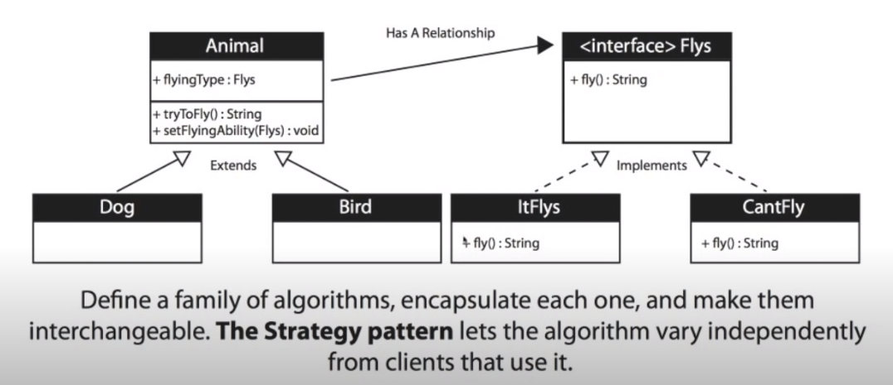
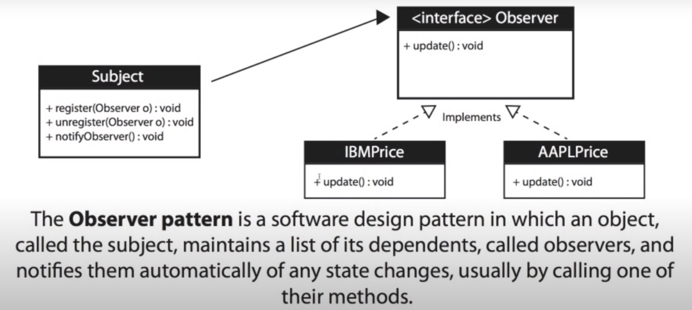

# Design Patterns

#### Design Patterns for Software Engineering

1. [Strategy Pattern](#strategy-pattern)
2. [Observer Pattern](#observer-pattern) 

---
## Strategy Pattern

### When to use the Strategy Pattern?

1. When you want to define a class that will have one behavior that is similar to other behaviors in a list
   * I want the class object to be able to choose from
     - Not Flying
     - Fly with Wings
     - Fly Super Fast
2. When you need to use one of several behaviors dynamically
3. Often reduces long lists of conditionals
4. Avoids duplicate code
5. Keeps class changes from forcing other class changes
6. Can hide complicated / secret code from the user
7. Negative: Increased Number of Objects / Classes

### UML Diagram for Strategy Pattern
  

---

## Observer Pattern

### When to use the Observer Pattern? 

1. When you need many other objects to receive an update when another object changes
   * Examples:
     - Stock market with thousands of stocks need to send updates to objects representing individual stocks
     - The Subject (publisher) sends many stocks to the Observers
     - The Observers (subscribers) taken the ones they want and use them
2. Loose coupling is a benefit
    * The Subject (publisher) doesn't need to know anything about the Observers (subscribers)
3. Negatives: The Subject (publisher) may send updates that don't matter to the Observer (subscriber)

### UML Diagram for Observer Pattern
  

