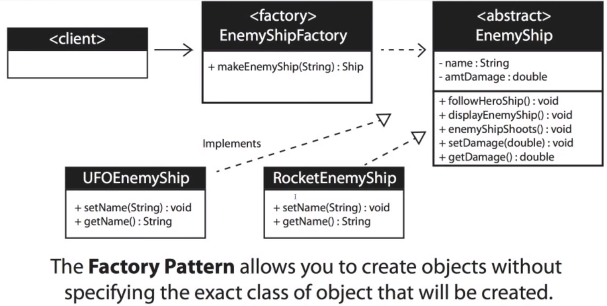

# Design Patterns

#### Design Patterns for Software Engineering

1. [Strategy Pattern](#strategy-pattern)
2. [Observer Pattern](#observer-pattern) 
3. [Factory Pattern](#factory-pattern)

---
## Strategy Pattern

### When to use the Strategy Pattern?

1. When a method returns one of several possible classes that share a common super class
   * Create a new enemy in a game
   * Random number generator picks a number assigned to a specific enemy
   * The factory returns the enemy associated with the number
2. The class is chosen at run time
3. When you don't know ahead of time what class object you need
4. when all of the potential classes are in the same subclass hierarchy
5. To centralize class selection code
6. When you don't want the user to have to know every subclass
7. To encapsulate object creation

### UML Diagram for Strategy Pattern
  

---

## Observer Pattern

### When to use the Observer Pattern? 

1. When you need many other objects to receive an update when another object changes
   * Examples:
     - Stock market with thousands of stocks need to send updates to objects representing individual stocks
     - The Subject (publisher) sends many stocks to the Observers
     - The Observers (subscribers) taken the ones they want and use them
2. Loose coupling is a benefit
    * The Subject (publisher) doesn't need to know anything about the Observers (subscribers)
3. Negatives: The Subject (publisher) may send updates that don't matter to the Observer (subscriber)

### UML Diagram for Observer Pattern
  

---

## Factory Pattern

### When to use the Factory Pattern? 

1. When you need many other objects to receive an update when another object changes
   * Examples:
     - Stock market with thousands of stocks need to send updates to objects representing individual stocks
     - The Subject (publisher) sends many stocks to the Observers
     - The Observers (subscribers) taken the ones they want and use them
2. Loose coupling is a benefit
    * The Subject (publisher) doesn't need to know anything about the Observers (subscribers)
3. Negatives: The Subject (publisher) may send updates that don't matter to the Observer (subscriber)

### UML Diagram for Factory Pattern
  

